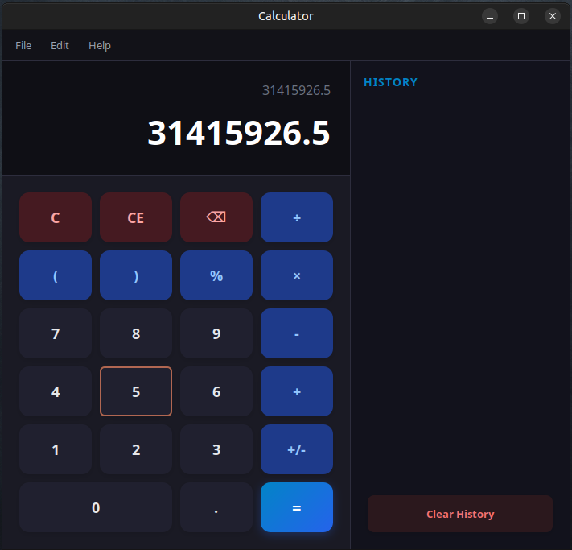
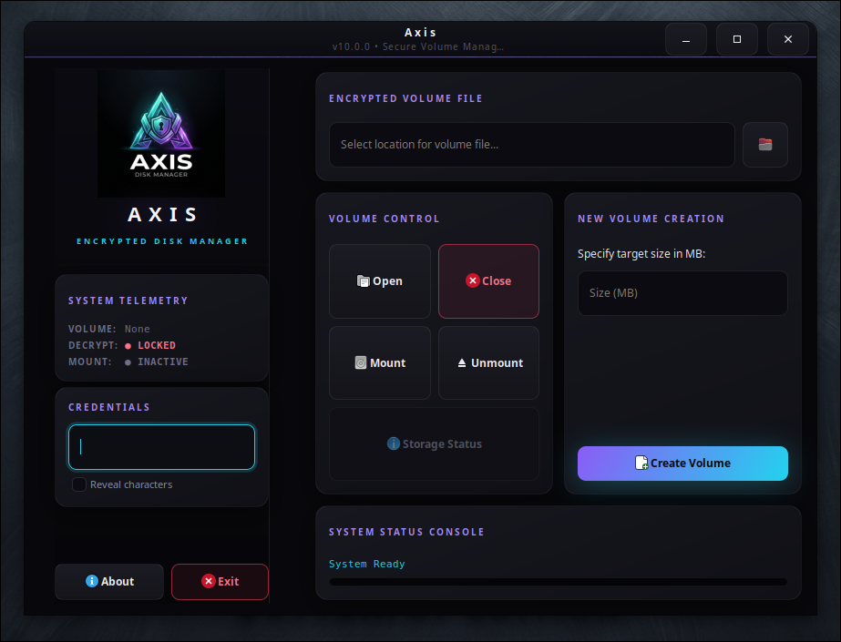

<div align="center">

# 🧮 Calculator

### A beautiful GTK3 calculator with a secret inside

[](https://www.kernel.org/)
[](https://en.wikipedia.org/wiki/C_(programming_language))
[](https://www.gtk.org/)
[](https://www.gnu.org/software/make/)
[](https://libsodium.org/)
[](https://pq-crystals.org/kyber/)
[](#-license)
[](#)
[](#-contributing)

*On the surface, an elegant desktop calculator. Underneath, a full post‑quantum encrypted disk manager — **Axis** — waiting for the right key sequence.*

</div>

---

## 📸 Screenshots

<div align="center">



*The calculator with the secret activation passcode (`31415926.5`) entered — press `=` to unlock.*

<br>



*The Axis Encrypted Disk Manager main window, revealed after entering the passcode.*

</div>

---

## 📑 Table of Contents

- [Screenshots](#-screenshots)
- [Overview](#-overview)
- [Features](#-features)
- [How It Works](#-how-it-works)
- [Prerequisites](#-prerequisites)
  - [Debian / Ubuntu](#debian--ubuntu)
  - [Fedora / RHEL](#fedora--rhel)
  - [Arch Linux](#arch-linux)
- [Building from Source](#-building-from-source)
- [Installation](#-installation-optional)
- [Running the Calculator](#️-running-the-calculator)
- [Unlocking the Hidden Disk Manager](#-unlocking-the-hidden-disk-manager)
- [Using Axis — Encrypted Disk Manager](#️-using-axis--encrypted-disk-manager)
  - [Creating an Encrypted Volume](#1-creating-an-encrypted-volume)
  - [Opening a Volume](#2-opening-a-volume)
  - [Mounting a Volume](#3-mounting-a-volume)
  - [Working with Your Files](#4-working-with-your-files)
  - [Unmounting and Closing](#5-unmounting-and-closing)
- [Security Architecture](#-security-architecture)
- [Security Notes & Best Practices](#️-security-notes--best-practices)
- [Troubleshooting](#-troubleshooting)
- [Project Layout](#️-project-layout)
- [Contributing](#-contributing)
- [License](#-license)
- [Author](#-author)


---

## 🔭 Overview

This project is a fully functional **GTK3 desktop calculator** — and a deliberate piece of misdirection.

Bundled alongside the calculator is a second, completely independent program disguised as an *"optional high‑precision computation engine."* In reality it is **Axis**, a post‑quantum **encrypted disk manager** that creates, mounts, and manages fully encrypted volumes through a FUSE filesystem.

Axis cannot be launched on its own. It only comes to life when the calculator is used to enter a specific activation sequence — a hidden trigger that quietly opens the disk manager while the calculator display resets to `0`, leaving no visible trace.

> 🎩 **The idea:** anyone glancing at the program sees a calculator. Only someone who knows the activation sequence can reach the encrypted volume manager hidden behind it.

---

## ✨ Features

### The Calculator
- 🪟 Clean, modern **GTK3** interface
- ➕ Standard arithmetic with operator precedence
- 🕘 Calculation history
- 🖥️ Installs as a proper desktop application (icon, menu entry, `.desktop` file)

### Axis — The Hidden Disk Manager
- 🛡️ **Uniform 256‑bit post‑quantum security** across all layers
- 🧬 **Hybrid key exchange** — CRYSTALS‑**Kyber‑1024** combined with **X448** elliptic‑curve Diffie‑Hellman
- 🔒 **Argon2id** password hashing with a **1 GB** memory cost (ASIC/GPU resistant)
- 🌑 **Plausible deniability** — volumes are indistinguishable from random noise (no magic headers on disk)
- 💾 **FUSE‑mounted virtual filesystem** — use the encrypted volume like any normal folder
- ⚡ **AVX2‑accelerated** wide‑state permutation core for high throughput
- 🔑 Per‑sector AES‑GCM encryption with fresh random nonces to prevent nonce reuse
- 🧹 Sensitive memory is locked (`mlock`) and core dumps are disabled to avoid key leakage

---

## 🧩 How It Works

The build produces **two separate binaries**:

| Binary | Role |
|--------|------|
| `calculator` | The visible GTK3 calculator |
| `calculator-module` | The disguised Axis disk manager (the "precision engine") |

When you enter the activation sequence into the calculator and press `=`, the calculator:

1. Resolves its own on‑disk location via `/proc/self/exe`.
2. Spawns the `calculator-module` binary sitting beside it.
3. Passes a one‑time shared secret to the module through an environment variable.
4. Silently resets its own display to `0`.

The `calculator-module` **refuses to start** unless it receives that shared secret — so running it directly from a terminal does nothing useful. This ensures Axis can only be reached *through* the calculator, exactly as intended.

---

## 📦 Prerequisites

You will need a C toolchain (`gcc`, `make`, `pkg-config`) and the following development libraries:

| Library | Purpose |
|---------|---------|
| **GTK 3** | Graphical interface for both the calculator and Axis |
| **libsodium** | Core cryptographic primitives (XChaCha20‑Poly1305, X448, Argon2id) |
| **FUSE 3** | Mounting the encrypted volume as a virtual filesystem |
| **OpenSSL (libcrypto)** | Additional cryptographic routines (AES‑GCM) |
| **libargon2** | Argon2id password hashing |

> 💡 The build also uses AVX2 SIMD instructions. A reasonably modern x86‑64 CPU (Haswell or newer) is recommended for the Axis engine.

### Debian / Ubuntu

```bash
sudo apt update
sudo apt install -y \
    build-essential \
    pkg-config \
    libgtk-3-dev \
    libsodium-dev \
    libfuse3-dev \
    libssl-dev \
    libargon2-dev
```

### Fedora / RHEL

```bash
sudo dnf install -y \
    gcc make pkgconf-pkg-config \
    gtk3-devel \
    libsodium-devel \
    fuse3-devel \
    openssl-devel \
    libargon2-devel
```

### Arch Linux

```bash
sudo pacman -S --needed \
    base-devel \
    pkgconf \
    gtk3 \
    libsodium \
    fuse3 \
    openssl \
    argon2
```

---

## 🔨 Building from Source

Clone the repository and run `make`:

```bash
git clone https://github.com/effjy/axis-secret.git
cd axis-secret
make
```

A styled progress bar tracks the build. When it finishes you will have **two** binaries in the project root:

```
calculator           # the calculator
calculator-module    # the hidden Axis disk manager
```

> ⚠️ **Keep the two binaries together.** The calculator launches `calculator-module` from the directory beside it, so moving one without the other will break the hidden trigger.

To clean all build artifacts:

```bash
make clean
```

---

## 🚀 Installation (Optional)

To install the calculator system‑wide (binaries, icons, and a desktop launcher entry):

```bash
sudo make install
```

This installs:

- `calculator` and `calculator-module` → `/usr/local/bin/`
- Application icons → `/usr/share/icons/` and `/usr/share/pixmaps/`
- Desktop entry → `/usr/share/applications/calculator.desktop`

After installation the **Calculator** appears in your application menu like any other app.

To uninstall:

```bash
sudo make uninstall
```

---

## ▶️ Running the Calculator

From the project directory:

```bash
./calculator
```

Or, if you installed it system‑wide, launch **Calculator** from your application menu, or run:

```bash
calculator
```

Use it as an ordinary calculator — arithmetic, history, the works.

---

## 🔓 Unlocking the Hidden Disk Manager

To reveal **Axis**, the calculator must be used as a keypad to enter the activation passcode.

1. **Launch the calculator** (see above).

2. **Type the activation sequence exactly:**

   ```
   31415926.5
   ```

3. **Press `=`** (or the `Enter` key).

The display **silently resets to `0`**, and the **Axis Encrypted Disk Manager** window opens.

> 🤫 There is no button, menu item, or visible hint for this. The sequence *is* the key — anyone who doesn't know it sees only a calculator. Memorize it; it is not stored anywhere the casual observer will find it.

If nothing happens, confirm that:
- `calculator-module` exists in the **same directory** as `calculator`.
- All [prerequisites](#-prerequisites) are installed.

---

## 🗄️ Using Axis — Encrypted Disk Manager

Once Axis opens, you'll see a dark "Aurora" interface with a **sidebar** (telemetry + credentials) and a **main panel** of volume operations.

The lifecycle of an encrypted volume is: **Create → Open → Mount → use files → Unmount → Close**.

### 1. Creating an Encrypted Volume

A *volume* is a single encrypted file that behaves like a private disk.

1. Enter (or **Browse** to) a path for the new volume file, e.g. `~/secret.vol`.
2. Enter a **size in MB** (minimum **10 MB**, maximum **1,048,576 MB / 1 TiB**).
3. Enter a strong **password** in the **Credentials** card.
4. Click **Create Volume**.

A progress bar tracks creation. When complete, the encrypted volume file is ready.

> 🔐 The password is run through **Argon2id with a 1 GB memory cost**. Creating and opening volumes requires roughly **1 GB of free RAM** and takes a few seconds by design — this is what makes brute‑forcing the password astronomically expensive.

### 2. Opening a Volume

Opening unlocks (decrypts) the volume's master key so it can be mounted.

1. Type the volume's **password** into the **Credentials** card.
2. Click **Open Volume** and select the volume file.

On success the sidebar telemetry switches **DECRYPT** to a green **UNLOCKED** state.

If opening fails, it usually means one of:
- ❌ Wrong password
- ❌ Corrupted volume file
- ❌ Not enough free RAM for Argon2 (needs ~1 GB)

### 3. Mounting a Volume

Mounting exposes the decrypted contents as a normal folder via **FUSE**.

1. With a volume open, click **Mount Volume**.
2. Choose an **empty directory** to serve as the mount point.

The sidebar **MOUNT** indicator turns green (**ACTIVE**). You can now open that directory in any file manager or terminal.

### 4. Working with Your Files

While mounted, the volume behaves like an ordinary folder:

```bash
# Example, assuming you mounted at ~/vault
cp ~/Documents/passwords.kdbx ~/vault/
ls ~/vault/
```

Everything written there is **transparently encrypted** sector‑by‑sector before it ever touches disk. Use **Check Free Space** in Axis to see total / used / free capacity of the mounted volume.

### 5. Unmounting and Closing

When finished:

1. Click **Unmount Volume** — this detaches the FUSE filesystem and flushes data.
2. Click **Close Volume** — this wipes the master key from memory and locks the volume again.

> 🧯 Closing Axis (via **Exit**) automatically unmounts and closes any open volume so your keys never linger in memory.

---

## 🧱 Security Architecture

Axis layers several mechanisms to provide a uniform 256‑bit post‑quantum security margin:

| Layer | Mechanism |
|-------|-----------|
| **Password hashing** | Argon2id — time cost 6, **1 GiB** memory, 4 lanes |
| **Hybrid key exchange** | CRYSTALS‑**Kyber‑1024** (`KYBER_K=4`) + **X448** ECDH |
| **Key wrapping / header** | XChaCha20‑Poly1305 (AEAD) |
| **Per‑sector data** | AES‑256‑GCM, fresh random 96‑bit nonce per sector write |
| **Permutation core** | 2048‑bit wide‑state, AVX2‑accelerated |
| **Filesystem** | Custom encrypted VFS, 4096‑byte sectors, up to 1024 files |

**Plausible deniability:** volumes carry no recognizable on‑disk signatures or headers — to forensic analysis they are mathematically indistinguishable from random data.

**Anti‑leakage hardening:** the module disables core dumps (`PR_SET_DUMPABLE` + `RLIMIT_CORE`), locks sensitive buffers into RAM (`mlock`), scrubs its launch token from the environment, and wipes passwords from the input widget immediately after use.

---

## 🛡️ Security Notes & Best Practices

- 🔑 **Use a strong, unique password.** There is no recovery mechanism — lose it and the data is gone forever.
- 🧠 **Provide enough RAM.** Argon2id needs ~1 GB free; on low‑memory systems opening will fail before the password is even checked.
- 💽 **Encrypt or disable swap.** Axis warns about unencrypted swap; if memory locking fails, keys could be paged to disk. Run with sufficient `memlock` limits (or as root) for maximum protection.
- 📦 **Back up your volume files.** They are ordinary files — copy them to safe storage. A corrupted volume cannot be opened.
- 🚪 **Always unmount and close** before shutting down or copying a volume.

---

## 🧰 Troubleshooting

| Symptom | Likely Cause / Fix |
|---------|--------------------|
| Entering the sequence does nothing | `calculator-module` not beside `calculator`; rebuild with `make` |
| `precision-engine: no compute context available` | You ran `calculator-module` directly — it only launches via the calculator |
| Build fails on `pkg-config` | A `-dev`/`-devel` package is missing; re‑check [Prerequisites](#-prerequisites) |
| "Failed to open volume" | Wrong password, corrupted file, or insufficient RAM for Argon2 |
| Mount fails / "Failed to start FUSE daemon" | FUSE 3 not installed, or you lack permission to mount; ensure `fuse3` is present |
| Memory‑locking warning on open | Increase `memlock` limits or run with elevated privileges |
| AVX2 / illegal instruction crash | CPU lacks AVX2; build on / run on a Haswell‑or‑newer x86‑64 machine |

---

## 🗂️ Project Layout

```
.
├── Makefile                 # Builds both calculator and calculator-module
├── calculator.desktop       # Desktop launcher entry
├── resources/               # Icons & logos
└── src/
    ├── main.c, gui.c, calc.c, history.c   # The calculator (visible app)
    └── engine/              # The hidden Axis disk manager
        ├── module_main.c    # Entry point (requires launch token)
        ├── panel.c          # Axis GUI
        ├── functions.c      # Volume create/open/mount/close logic
        └── solver/          # Post-quantum crypto core (Kyber, etc.)
```

---

## 🤝 Contributing

Contributions, bug reports, and feature requests are welcome!

1. Fork the repository
2. Create a feature branch (`git checkout -b feature/my-feature`)
3. Commit your changes
4. Open a Pull Request

Please keep the calculator and Axis cleanly separated, and avoid introducing dependencies beyond those already listed.

---

## 📄 License

Released under the **MIT License**. See the `LICENSE` file for details.

---

## 👤 Author

**Jean‑Francois Lachance‑Caumartin** *(Effjy)*
📧 effjy@protonmail.com

<div align="center">

*Built with C, GTK, and a healthy appreciation for hiding things in plain sight.* 🧮🔐

</div>
